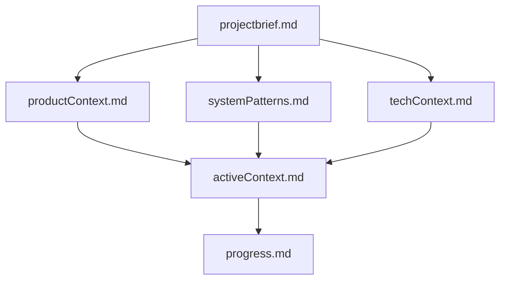
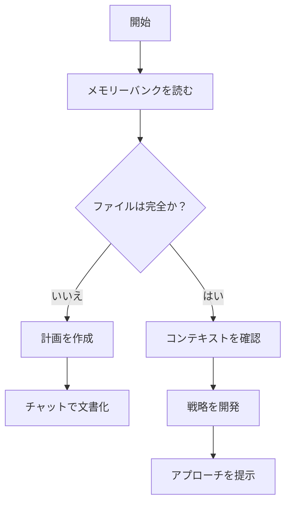
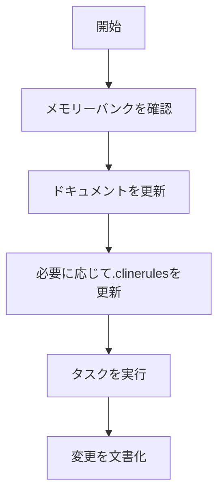
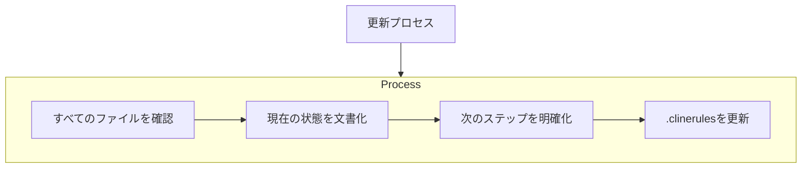
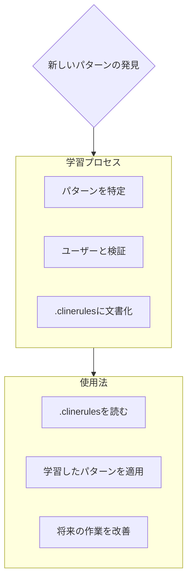

# LLM 向け最適化.clinerules

## 3. メモリーバンクシステム

### 3.1 概要

Roo はセッション間で記憶がリセットされるため、メモリーバンクに完全に依存している。すべてのタスク開始時に全メモリーバンクファイルを読む必要がある。

### 3.2 ファイル構造

### 3.3 コアファイル（必須）

1. **projectbrief.md**

   - 基盤となる文書
   - コア要件と目標を定義
   - プロジェクト範囲の信頼できる情報源

2. **productContext.md**

   - プロジェクトの存在理由
   - 解決する問題
   - 機能要件
   - ユーザー体験の目標

3. **activeContext.md**

   - 現在の作業の焦点
   - 最近の変更
   - 次のステップ
   - アクティブな決定事項

4. **systemPatterns.md**

   - システムアーキテクチャ
   - 重要な技術的決定
   - 設計パターン
   - コンポーネント関係

5. **techContext.md**

   - 使用技術
   - 開発環境設定
   - 技術的制約
   - 依存関係

6. **progress.md**
   - 機能している部分
   - 残りの作業
   - 現在の状態
   - 既知の問題

### 3.4 追加コンテキスト

必要に応じて`memory-bank/`内に追加ファイル/フォルダを作成：

- 複雑な機能のドキュメント
- 統合仕様
- API ドキュメント
- テスト戦略
- デプロイ手順

### 3.5 ワークフロー

#### 計画モード

#### 実行モード

### 3.6 更新タイミング

メモリーバンクの更新は以下の場合に実施：

1. 新しいプロジェクトパターンの発見時
2. 重要な変更の実装後
3. ユーザーが**update memory bank**と要求した場合
4. コンテキストの明確化が必要な場合

### 3.7 プロジェクトインテリジェンス

.clinerules ファイルはプロジェクトの学習ジャーナルとして機能：

#### 記録すべき内容

- 重要な実装パス
- ユーザーの設定とワークフロー
- プロジェクト固有のパターン
- 既知の課題
- プロジェクト決定の進化
- ツール使用パターン
